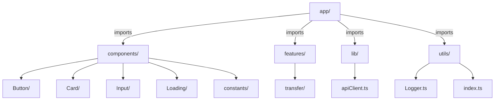
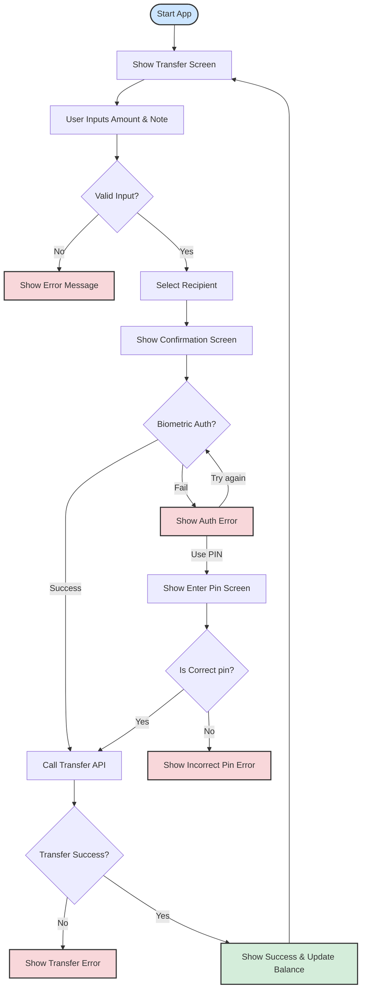

# Project Structure

This project follows a structure inspired by [bulletproof-react](https://github.com/alan2207/bulletproof-react) for
maintainable React/React Native applications. Each feature is encapsulated with its own API logic, screens, state management, and utilities.

```
src/
  ├── app/           # App root, entry point, navigation
  ├── components/    # Shared UI components (Button, Card, Input, etc.)
  ├── features/      # Feature modules (e.g., transfer)
  │     ├── api/         # Feature-specific API logic
  │     ├── screens/     # Feature-specific UI Screens
  │     ├── data/        # Feature-specific data, mock data, fixtures
  │     ├─  hooks/       # Feature-specific hooks
  │     ├── store/       # Feature-specific state management (slices, reducers)
  │     ├── types/       # Feature-specific types and interfaces
  │     └── utils/       # Feature-specific utilities
  ├── lib/           # Standalone libraries (e.g., apiClient)
  ├── utils/         # Helper functions and utilities
  └── README.md      # This file
```

## Project Structure Diagram



## Transfer Feature Flowchart

